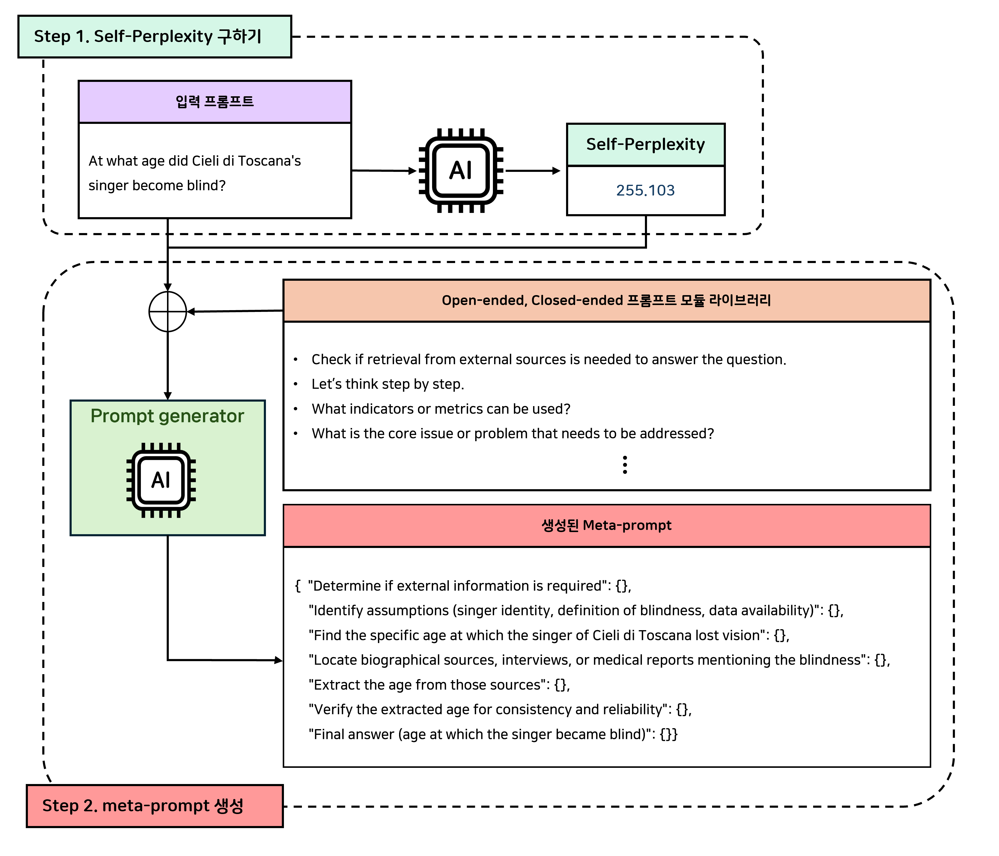

# AGI 발현을 위한 메타인지 프레임워크 핵심기술 개발 및 실증
## AGI 발현을 위한 Planner에 대한 연구 개발
### 입력 프롬프트를 최적으로 처리하기 위한 프롬프트 라이브러리 운용을 AI가 결정하는 메타프롬프팅 기법
### 💡 예시


## ⚙️ Requirements
To install requirements:
```
pip install -r requirements.txt
```

## 💻 Usage Guide
### 1. Dataset 준비
- 자세한 내용은 [README.md](data/README.md)를 참고해주세요.

### 2. 메타프롬프트 생성
```
python src/main.py --model_name "model_name" --dataset_name "dataset_name" --delta_gain_coef 0.07 --alpha_neg_cap 1.0
```
meta-prompt는 다음 과정을 통해 생성됩니다: \
- Step 1: Self-Perplexity(SPP) 계산
- Step 2: 프롬프트 모듈 선택 및 적응
   - 선택된 모듈을 입력 프롬프트에 맞게 적응(adaptation)시킨 뒤, reasoning 과정을 단계적으로 구성하여 최종 메타프롬프트를 생성합니다.

## 🧠 작동 원리
**1️⃣ Self-Perplexity(SPP) 값 측정** \
주어진 입력(input)에 대해 Perplexity를 계산하여, \
모델이 해당 입력을 얼마나 확신(Certain) 또는 불확신(Uncertain) 하는지를 측정합니다.
- SPP 값이 작을수록: 모델이 입력을 충분히 이해하고 있음 → 내부 지식만으로 해결 가능
- SPP 값이 클수록: 모델이 입력을 해석하기 어렵거나 자신감이 낮음 → 외부 정보 필요

따라서 SPP가 큰 경우, 모델은 자체 지식만으로는 답변이 어려운 상황으로 간주되며, \
총 40개의 프롬프트 모듈 라이브러리 중 RAG 관련 모듈을 포함하여 선택하도록 유도합니다.

**2️⃣ 메타프롬프트 생성** \
메타프롬프트는 총 3단계를 거쳐 생성됩니다.

**Step 1: SELECT — 프롬프트 모듈 선택**
이 단계에서는 SPP값도 활용하여, 입력 프롬프트를 해결하는 데 필요한 프롬프트 모듈을 선택합니다. \
우선, ```step_decode_with_bias()```에서 계산된 $$\alpha$$ 값이 모델의 불확실도를 수치화하여 프롬프트 선택에 반영됩니다. \
$$\alpha$$는 다음 두 가지 형태의 bias로 작용합니다:
  - **scale_gain**: 확신도가 높을수록 감소(−), 불확실할수록 증가(+) → 특정 모듈의 중요도를 조절  
  - **delta_gain**: 방향성 변화를 통해 RAG 사용 관련 모듈에 더 큰 가중치를 부여  
이렇게 조정된 bias는 RAG 사용 관련 모듈의 선택 확률을 높입니다. \
즉, SPP가 높아 모델이 불확실할수록 retrieval 관련 module이 선택될 확률이 높아지게 됩니다. 
#### 🧩 예시
```
1. Check if retrieval from external sources is needed to answer the question.
6. What are the key assumptions underlying this problem?
17. What is the core issue or problem that needs to be addressed?
21. Are there any relevant data or information that can provide insights into the problem? If yes, what data sources are available, and how can they be analyzed?
```

**Step 2: ADAPT — 선택된 모듈의 입력 적응화**
선택된 모듈은 입력 프롬프트에 맞게 context-aware adaptation 과정을 거칩니다. 
#### 🧩 예시
```
1. Determine whether external information (e.g., biographical data, news articles, official statements) is required to find the age at which the singer became blind.
6. Identify assumptions such as the singer's identity, the definition of “blind,” and the availability of reliable age data.
17. Find the specific age at which the singer of Cieli di Toscana lost vision.
21. Locate biographical sources, interviews, or medical reports that mention the singer's blindness, and outline methods to extract the age from those sources.
```

**Step 3: IMPLEMENT — 단계적 reasoning 구성** \
모델은 Step 2의 적응 결과를 기반으로, 각 reasoning 단계를 계층적 구조로 정리하여 최종 meta-prompt를 생성합니다.
#### 🧩 예시
```
{
   "Step 1: Determine if external information is required": {},
   "Step 2: Identify assumptions (singer identity, definition of blindness, data availability)": {},
   "Step 3: Find the specific age at which the singer of Cieli di Toscana lost vision": {},
   "Step 4: Locate biographical sources, interviews, or medical reports mentioning the blindness": {},
   "Step 5: Extract the age from those sources": {},
   "Step 6: Verify the extracted age for consistency and reliability": {},
   "Step 7: Final answer (age at which the singer became blind)": {}
}
```

**💡 장점**
- 기존의 고정된 confidence threshold 방식과 달리, SPP를 활용하여 모델의 확신도를 동적으로 조정함으로써 open-ended와 closed-ended 질문 모두에 유연하게 대응할 수 있습니다.  
  - SPP를 통해 모델은 스스로 *“어떤 상황에서 외부 정보가 필요한가”* 를 판단하여, 불확실한 입력에서는 RAG 관련 모듈을 선택하도록 유도하고, 확신이 높은 경우 내부 지식만으로 reasoning을 수행하도록 안내합니다.
- 프롬프트 모듈을 SELECT → ADAPT → IMPLEMENT 단계로 분리하여, 모델이 reasoning 단계를 명시적으로 구성하도록 유도합니다.  
  - 이를 통해 meta-prompt 기반의 reasoning 과정이 보다 구조적이고 일관되며, 최종 답변의 정확도와 추론 신뢰성을 향상시킬 수 있습니다.

### Reference
[Self-Discover: Large Language Models Self-Compose Reasoning Structures](https://proceedings.neurips.cc/paper_files/paper/2024/file/e41efb03e20ca3c231940a3c6917ef6f-Paper-Conference.pdf)
```
@inproceedings{NEURIPS2024_e41efb03,
 author = {Zhou, Pei and Pujara, Jay and Ren, Xiang and Chen, Xinyun and Cheng, Heng-Tze and Le, Quoc V. and H., Ed and Zhou, Denny and Mishra, Swaroop and Zheng, Huaixiu Steven},
 booktitle = {Advances in Neural Information Processing Systems},
 editor = {A. Globerson and L. Mackey and D. Belgrave and A. Fan and U. Paquet and J. Tomczak and C. Zhang},
 pages = {126032--126058},
 publisher = {Curran Associates, Inc.},
 title = {SELF-DISCOVER: Large Language Models Self-Compose Reasoning Structures},
 url = {https://proceedings.neurips.cc/paper_files/paper/2024/file/e41efb03e20ca3c231940a3c6917ef6f-Paper-Conference.pdf},
 volume = {37},
 year = {2024}
}
```
